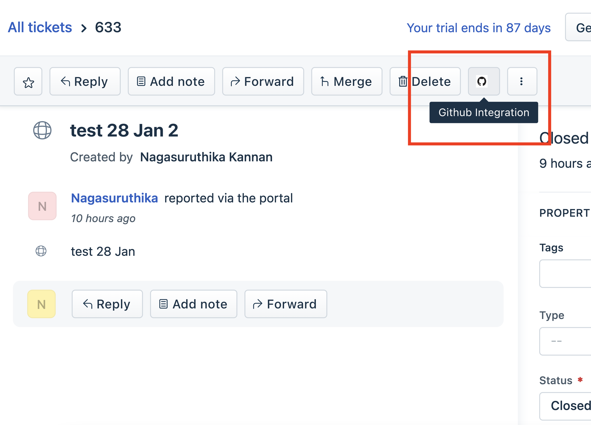
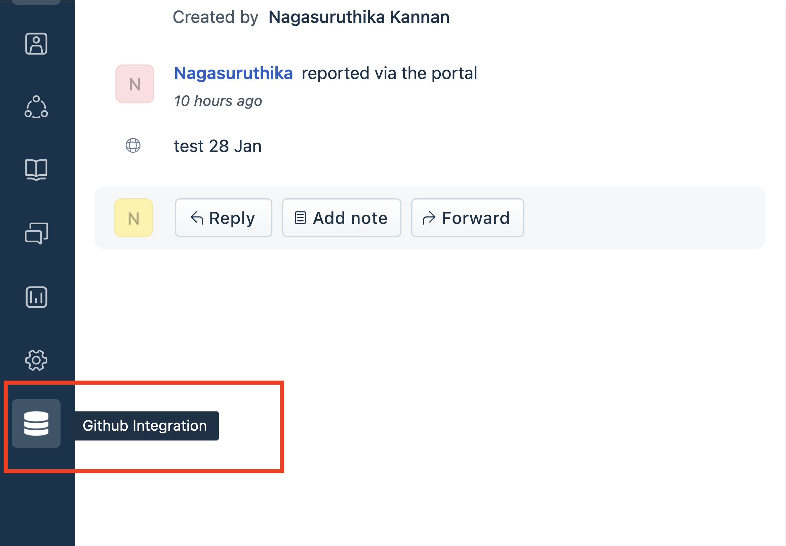
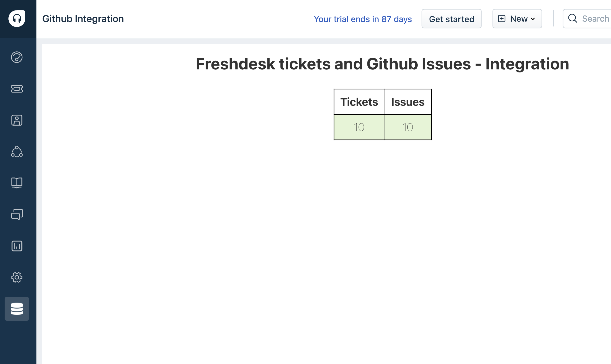

# github-freshdesk-integration

Freshdesk - Github Integration App

## Description

Simple integration between Freshdesk Github. The app performs the following functionalities :
  - Bidirectional sync - When a ticket is created in freshdesk, the same should be created in Github. When an issue is created in github it should create a ticket       in freshdesk, similar action when a FD ticket/ Github Issue is closed.
  - Table (full page app) - Displaying the number of tickets and issues linked.
  - Redirection (Top Navigation Bar) - Button that redirects to the github issue.

***

## Screenshots
### ticket_top_navigation to github issue

### table (full page app)

  

***

## Features Demonstrated

Product: Freshdesk
App location: ticket_top_navigation on Ticket Details Page and a full_page_app.

| Feature | Notes |
| :---: | --- |
| [`Custom Installation Page`](https://developers.freshdesk.com/v2/docs/custom-installation-page/) | Custom page to configure Installation parameters  |
| [`Data Method`](https://developers.freshdesk.com/v2/docs/data-methods) | Data Method is used to retrieve _Ticket Details_ |
| [`Request Method`](https://developers.freshdesk.com/v2/docs/request-method) | Request Method has been used to make secure API calls to the third party domain. |
| [`Key-Value Storage`](https://developers.freshdesk.com/v2/docs/key-value-storage) | Data storage is used to store info about linked tickets , issues|
| [`External events`](https://developers.freshdesk.com/v2/docs/external-events) | External events is used to register,deregister webhooks, and listen to events in the github repository |

## Prerequisites

1. Make sure you have a trial Freshdesk account created
2. A properly configured [Development environment](https://developers.freshdesk.com/v2/docs/quick-start/) along with the [FDK (Freshworks Development Kit)](https://developers.freshdesk.com/v2/docs/freshworks-cli/).
3. A Github account.

***

## Procedure to run the app

1. Run the app locally using the [`fdk run`](https://developers.freshdesk.com/v2/docs/freshworks-cli/#run) command.
2. Go to `http://localhost:10001/custom_configs` in your browser to set up the installation parameters.
3. Go to Freshdesk, navigate to the tickets page and select any ticket.
4. Refer to the [Test the app](https://developers.freshdesk.com/v2/docs/quick-start/#test_your_app) section of the quickstart guide to allow insecure content.
5. Append `?dev=true` to the URL to see the changes
.
***

## Additional Notes

- you can get the API key of Freshdesk in following way
  - Log in to your support portal.
  - Click on your profile picture on the top right corner of your portal.
  - Go to Profile settings Page
